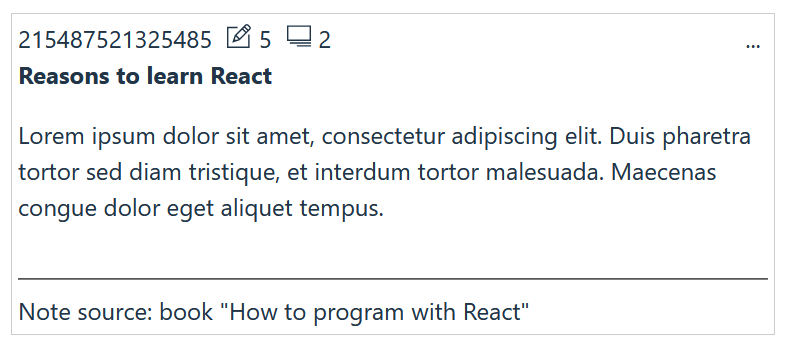
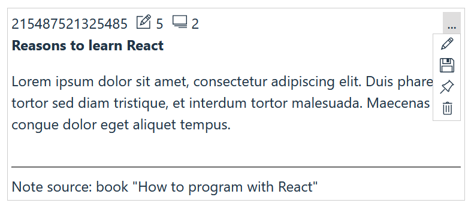

# @jovita-li/zettelkasten-card

Card component for Zettelkasten-style notes, designed for React applications.

## Table of Contents

- [Installation](#installation)
- [Usage](#usage)
- [Licenses](#licenses)
- [Changelog](#changelog)

## Installation

```bash
npm install @jovita-li/zettelkasten-card
```

## Usage

Here is an example of how to use the `ZettelCard` component:

```
import React from "react";
import { ZettelCard } from "@jovita-li/zettelkasten-card";
import {
  TfiPencilAlt,
  TfiPencil,
  TfiPinAlt,
  TfiTrash,
  TfiSave,
  TfiLayoutMediaRightAlt,
} from "react-icons/tfi";
import "./App.css";

function App() {
  const headerChildren: React.ReactNode[] = [
    <span style={{ marginRight: "10px" }}>
      <TfiPencilAlt />
      <span style={{ marginLeft: "5px" }}>5</span>
    </span>,
    <span>
      <TfiLayoutMediaRightAlt />
      <span style={{ marginLeft: "5px" }}>2</span>
    </span>,
  ];

  return (
    <>
      <ZettelCard
        uniqueId="215487521325485"
        title="Reasons to learn React"
        cardContainerStyle={{ maxWidth: "500px" }}
        cardHeaderChildren={headerChildren}
        cardMenuChildren={[
          <TfiPencil />,
          <TfiSave />,
          <TfiPinAlt />,
          <TfiTrash />,
        ]}
        cardFooterChildren={[
          <hr />,
          <div>Note source: book "How to program with React"</div>,
        ]}
      >
        <div>
          <p>
            Lorem ipsum dolor sit amet, consectetur adipiscing elit. Duis
            pharetra tortor sed diam tristique, et interdum tortor malesuada.
            Maecenas congue dolor eget aliquet tempus.
          </p>
        </div>
      </ZettelCard>
    </>
  );
}

export default App;
```





## Licenses

All files on the Zettel Card GitHub repository are subject to the MIT license. Please read the License file at the root of the project.

## Changelog

We use [GitHub Releases](https://github.com/JovitaLipkiene/zettel-card/releases) to manage our releases, including the changelog between every release. View a complete list of additions, fixes, and changes on the [releases page](https://github.com/JovitaLipkiene/zettel-card/blob/main/CHANGELOG.md).
